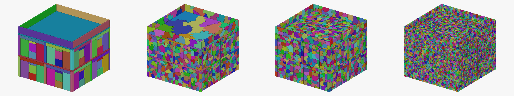
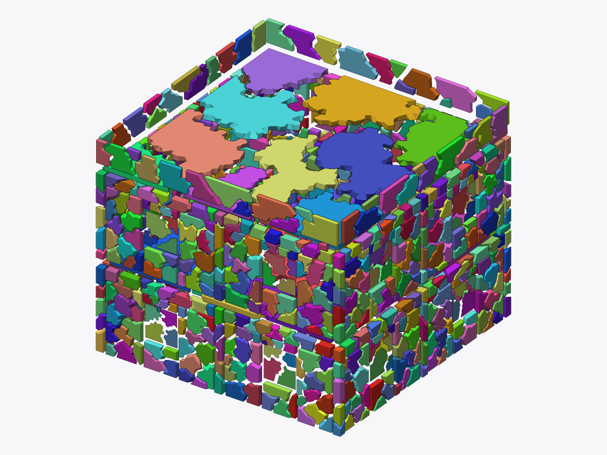
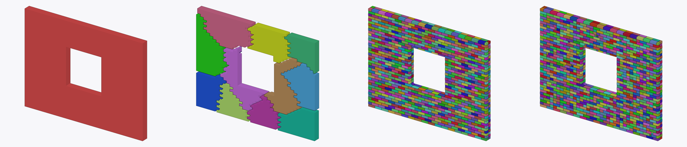
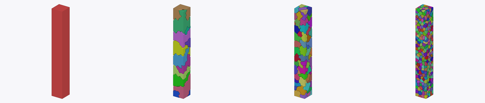

# Shardwright

A toolkit that fractures any mesh along its real material and structural weak
points. It produces render-ready fragments and exact bond graphs for
destruction solvers.

`prefracture` is an offline Rust library and CLI that implements the
*Pre-Fracture Library — Engineering Spec v1.0*. It takes a glTF/OBJ/PLY/STL
scene plus authoring metadata and produces:

* a **glTF render payload** (`.glb`): one node per fragment, shared displaced
  interior surfaces, chipping, triplanar interior UVs, LODs (`MSFT_lod`),
  meshopt compression and rebar stubs;
* a **physics payload** (`.fracphys`, FlatBuffers, `schemas/frac.fbs`): the
  L0–L3 fragment hierarchy, exact mass properties, non-overlapping convex
  hulls, and bonds with exact area, centroid, normal, second moments, frame,
  extent, composition, rebar crossings, boundary loops, Weibull strength and
  parent/child links;
* a **report** (`.report.md` / `.report.json`): hard gates (§13.1), scorecard
  metrics and stage timings.

## Setup

```sh
tools/setup.sh              # idempotent: system libs, Rust build, Node glTF validator,
                            # Python oracle env (Kratos, gmsh, scikit-fem, CoACD, ...),
                            # flatc v24.3.25, Voro++ oracle
tools/setup.sh --check      # report what is installed
tools/setup.sh --no-oracles # Rust build + glTF validator only
```

Install locations default to `/opt/fracenv` (Python) and `/opt/oracles`
(flatc, Voro++). Override them with `FRACENV` and `ORACLES`; the CLI and the
tests read the same variables. For Claude Code cloud sessions, set the
environment's *Setup script* to `tools/setup.sh` so every new session starts
fully provisioned.

## Quick start

```sh
cargo build --release
# bake one asset (sidecar metadata <input>.meta.json is picked up automatically)
./target/release/prefracture bake --input benchmarks/assets/rc_column.glb \
    --config benchmarks/configs/bake.toml --out out/ [--check-determinism]
# re-validate and run the FEM bond-fidelity oracle (needs the Python harness env)
./target/release/prefracture validate --input out/rc_column.asset.json --oracle-cache /tmp/oracle
./target/release/prefracture inspect --input out/rc_column.fracphys
./target/release/prefracture diff --a out/a.fracphys --b out/b.fracphys
./target/release/prefracture patterns --out patterns.fracpat   # runtime pattern library (M5)
./target/release/prefracture gen-bench                         # regenerate benchmarks/assets
```

Configs: `benchmarks/configs/bake.toml` is the spec defaults with fracture
modes enabled. `building.toml` keeps every quality feature (modes, interface
noise, chipping, 3 LODs, CoACD hulls) with cells sized for multi-storey
buildings (~29 cm analysis / ~18 cm fine cells; bake.toml's 8.5 cm fine
cells give ~450k cells on a 5-storey frame). `building_lite.toml` is a quick
starter (no modes, no noise, one LOD). `fast.toml` disables modes and uses
agglomeration for Level 1. `ablation_geometric.toml` and
`ablation_fallback.toml` are the M3 ablations.

## Performance

`tools/ci/suite.sh [config] [assets...]` bakes the suite and records wall
time (whole CLI run: bake, payloads, Khronos glTF validator, flatc, asset
dump), peak RSS and gates against a per-asset budget (`BUDGET_S`, default
300 s). On a 4-core machine (all gates pass on every asset):

| Asset | Config | Time (s) | Peak RSS (MB) |
|---|---|---|---|
| ceramic_bowl | bake.toml | 5.6 | 70 |
| glass_annealed_pane | bake.toml | 1.0 | 18 |
| glass_tempered_pane | bake.toml | 19.3 | 126 |
| brick_wall_window | bake.toml | 12.7 | 429 |
| rc_column (1537 cells, `fine_per_analysis = 16`) | bake.toml | 7.1 | 194 |
| timber_beam | bake.toml | 3.1 | 83 |
| rc_slab_on_columns | bake.toml | 30.6 | 880 |
| messy_scan | bake.toml | 71.7 | 946 |
| two_storey_building (60,920 cells) | bake.toml | 256.9 | 7,494 |
| held-out: concrete_pipe / drywall_door / stone_arch | bake.toml | 5.7 / 2.0 / 8.7 | ≤ 156 |
| building_v0 (2 storeys, 132 parts) | building_lite.toml | 13.8 | 318 |
| building_v0 (2 storeys, 132 parts) | building.toml | 45.1 | 1,086 |
| building_v1 (5 storeys, 419 parts, 42,547 cells) | building.toml | 139.4 | 3,512 |

bake.toml and building.toml use a collision budget of 128 hulls per
fragment (the library default is 8). Two-storey stages (bake.toml): cells
11 s, hierarchy with fracture modes 32 s, collision 41 s, render 39 s,
validation 59 s, glTF and external validators ~69 s.
`FRAC_LOG=1` prints per-stage times, sub-stage breakdowns and RSS.

## Previews

`prefracture preview --input out/X.asset.json --out X.png [--level N | --all-levels] [--explode 0.1]`
renders each fragment's exact boundary in its own colour (software
rasterizer, deterministic). The images below are levels L0 → L3, left to
right.






More in [`docs/previews/`](docs/previews/).

## Layout

See [`docs/DESIGN.md`](docs/DESIGN.md) for the crate map, algorithms and
every deviation from the spec. See [`docs/VALIDATION.md`](docs/VALIDATION.md)
for oracle results: the benchmark suite, FEM bond fidelity, the convex
decomposition against upstream CoACD, and crack placement.
[`docs/TESTING.md`](docs/TESTING.md) covers the test tiers and the golden
oracle dataset, which scores builds against frozen FEM, crack and Voro++
answers without the slow oracles.

### Docker

```sh
docker build -t shardwright .
docker run --rm -v "$PWD/out:/work/out" shardwright bake \
    --input benchmarks/assets/rc_column.glb --config benchmarks/configs/bake.toml --out /work/out
```

The image contains the CLI and every oracle (Kratos FEM, CoACD, flatc,
Voro++, Khronos validator). Behind a TLS-intercepting proxy, put its CA
certificate in `tools/docker/certs/` and build with
`--network host --build-arg HTTPS_PROXY=…`.

| Path | Contents |
|---|---|
| `crates/` | the 16 workspace crates (`frac-core` … `frac-cli`) |
| `schemas/` | FlatBuffers schemas (`frac.fbs`, `fracpat.fbs`) and TypeScript bindings |
| `benchmarks/` | benchmark assets (11 + 3 held-out) and configs |
| `tools/harness/` | oracles: Kratos FEM bond fidelity, scikit-fem modal, CoACD differential, Rankine crack oracle |
| `tools/oracles/` | Voro++ differential oracle |
| `tools/gltf_validate/` | Khronos glTF validator wrapper |
| `tools/ci/` | determinism, golden and suite scripts (determinism also runs in `.github/workflows/ci.yml` on Linux and macOS) |

## Oracle environment

The pinned packages are listed in `tools/harness/requirements.txt`
(Kratos Multiphysics 10.4 with StructuralMechanics and LinearSolvers, gmsh,
scikit-fem, scipy, coacd, manifold3d and trimesh). The harness Python
resolves in this order: `PREFRACTURE_PYTHON`, then `$FRACENV/bin/python`,
then `/opt/fracenv/bin/python`. The glTF gate uses Node with the Khronos
validator in `tools/gltf_validate`.
